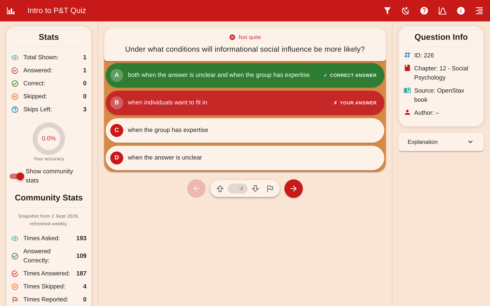

# Intro to P&T Quiz

A practice-question app for the **Introduction to Psychology & Technology** course at TU/e
Eindhoven, built and run by a student of the course and used by the cohorts after him.

**Live:** <https://quiz.jakubwerner.com/ipt/>



Students answer multiple-choice questions filtered by chapter and source, see an explanation
after each one, and can flag, upvote or downvote a question. Every answer feeds anonymous
community counters, so the app can show "109 of 187 people got this right" next to the
question — and those same counters are what drives the periodic review of the question bank.

| | |
| --- | --- |
| Questions answered since launch | ~120,000 (86,000 correct) |
| Questions in the quiz today | 829 active, from ~1,000 collected |
| Where they come from | Two years of student-written questions and the OpenStax *Psychology 2e* book |
| Running cost | €0 — static hosting, a write-only Firestore on the free tier, and a domain |

Built by Jakub Werner. Thanks to prof. Daniël Lakens for endorsing the idea, and to Tim,
Aaravee, Naomi, Eline, Finn and Hubert. This is not an official part of the TU/e course, just a
passion project — I am not responsible for any mistakes or inaccuracies.

## What is worth a look

- **The question bank has been audited, with a paper trail.** In September 2026 every active
  question was reviewed against the OpenStax text, one LLM reviewer per chapter, with the
  community stats attached as a signal. 25 wrong keys were corrected, 99 questions fixed, 127
  disabled. Every change is recorded with its reason in
  [`data/question_review_2026-09.json`](data/question_review_2026-09.json), the rubric is in
  [`data/question_review_rubric.md`](data/question_review_rubric.md), and
  [`scripts/apply_question_review.py`](scripts/apply_question_review.py) applies a findings file
  so the pass can be repeated next year.
- **Below-chance correct rates find wrong answer keys.** A four-option question that fewer than
  35% of students get right is usually keyed wrong, not hard. 99 of the 136 questions that
  [`scripts/triage_questions.py`](scripts/triage_questions.py) pointed at needed a real fix.
- **The stats cost nothing to serve.** The app never reads the database. It ships a snapshot of
  all counters (`frontend/public/stats.json`) that a GitHub Action refreshes weekly, and only the
  ±1 counter *writes* go to Firestore, fire-and-forget. No network call sits between a student
  and the next question, and the free tier covers roughly 20,000 answers a day.
- **The database is locked down and the lockdown is verified from outside.** The
  [security rules](firestore.rules) allow exactly one thing: move one of seven known counters by
  ±1. [`scripts/verify_firestore_rules.py`](scripts/verify_firestore_rules.py) probes the *deployed*
  rules with nothing but the public web key, in both directions — that abuse is refused and that
  the app's real write shapes still work.
- **Student authors are pseudonymous.** The question export used to carry TU/e student numbers.
  It now carries salted HMAC tokens, and `scripts/purge_student_numbers_from_history.sh` removes
  the originals from git history.
- **The build refuses to ship broken output.** `scripts/build_site.sh` fails on a missing route,
  assets that do not match the base path, a page without a `<title>`, fewer than 500 questions,
  an un-hashed student number, malformed explanation markup, or a missing stats snapshot.

## Stack

Nuxt 4 + Vuetify 3 single-page app, Pinia for state, Firebase JS SDK for the counter writes.
Static output on Cloudflare (Workers Builds). Python for the question pipeline and admin
tooling, Streamlit for the admin dashboard, Firestore for the counters.

## Repository layout

| Path | What it is |
| --- | --- |
| `frontend/` | The Nuxt app students use |
| `frontend/public/l3.json` | The question set the app ships with |
| `frontend/public/stats.json` | The community-stats snapshot the app ships with |
| `scripts/` | Question pipeline (Google Sheets → SQLite → LLM enrichment → `l3.json`), review and triage tools, Firestore admin scripts, and `build_site.sh` |
| `data/` | The review record and rubric; also the working database and backups (gitignored) |
| `dashboard/` | Streamlit dashboards for browsing and administering questions |
| `deploy/root/` | Files copied to the site root by the build (redirects, `robots.txt`, sitemap) |
| `firestore.rules` | Security rules for the counters |
| `.github/workflows/` | Weekly stats-snapshot refresh |

## Running it locally

```bash
cd frontend
npm install
npm run dev          # http://localhost:3000/ipt/
```

The dev server serves the app under the `/ipt/` base path, same as production. When the page is
served from `localhost`, `127.0.0.1` or a `.local` host, no counter updates are sent to the live
database (append `?firestore=live` to override).

To reproduce exactly what gets deployed:

```bash
bash scripts/build_site.sh     # -> ./dist
npx serve dist                 # then open http://localhost:3000/ipt/
```

## How it is deployed

Cloudflare builds straight from this repository on every push to `main` (Workers & Pages →
the `quiz` project; build command `bash scripts/build_site.sh`, output directory `dist`,
`.node-version` pins Node 22). The custom domain `quiz.jakubwerner.com` is on the same Cloudflare
zone, so the record and certificate are managed for you.

The build produces:

```
dist/
  index.html      redirect to /ipt/
  404.html        maps known routes into /ipt/, everything else to /ipt/
  itp/index.html  /itp/ is a common typo for /ipt/
  robots.txt      these only work at the origin root, not under /ipt/
  sitemap.xml
  ipt/            the Nuxt app (app.baseURL is /ipt/, so it MUST live in this directory)
```

The app is deliberately mounted at a subpath so more courses can live alongside it: build another
app with its own `app.baseURL` and copy it into another directory under `dist/` in
`scripts/build_site.sh`.

Check the result from outside your own network (`dig @1.1.1.1 quiz.jakubwerner.com`, or a phone on
mobile data) — if `jakubwerner.com` names resolve to something private on your machine, the
site loading locally proves nothing about whether students can reach it.

## Updating the questions

`frontend/public/l3.json` is what the app loads at runtime. The pipeline that produces it lives in
`scripts/` (`scripts/pipeline_steps.txt` has the intended order). After regenerating, run the two
clean-up steps and copy the result into place; pushing redeploys.

```bash
python3 scripts/fix_l3_html.py       frontend/public/l3.json   # repair `<pFoo` / `</>` in explanations
python3 scripts/anonymize_authors.py frontend/public/l3.json   # hash student numbers
python3 scripts/anonymize_authors.py frontend/public/l3.json --check   # fails if any raw id remains
```

The app also normalises data as it loads (trims whitespace, strips leftover `a.`/`b.` option
prefixes, keeps "none of the above"-style options last, repairs malformed explanation markup), so
the raw export does not have to be perfect.

Per-question fields: `id`, `question_title`, `chapter_id`, `correct_answer`, `distractor_1..3`,
`source`, `author`, `description_llm`, `is_disabled`. A truthy `is_disabled` (`1`, `true`, `"1"`)
hides a question; the string `"0"` counts as *not* disabled. Chapters in `BANLIST_CHAPTERS`
(`frontend/app/stores/question.js`) are excluded regardless of the data — 11, 13 and 16 are out
of scope for this course.

### Reviewing the question bank

Start from the community stats rather than reading everything:

```bash
python3 scripts/triage_questions.py                # questions most likely to be wrong, by score
python3 scripts/triage_questions.py --chapter 7
```

The September 2026 pass is the reference for how a full review goes. Every active question was
checked against OpenStax *Psychology 2e* on 2026-09-02 with the rubric in
`data/question_review_rubric.md`:

| Outcome | Questions |
| --- | --- |
| Active before / after | 956 / 829 |
| Wrong key corrected | 25 |
| Other fixes (ambiguous, broken stem, weak distractor, typo, wrong explanation) | 99 |
| Moved to the chapter they actually belong to | 44 |
| Disabled as duplicates | 79 |
| Disabled as unanswerable from the book or unsalvageable | 48 |

Disabled questions stay in the file with `is_disabled: "1"`, so any of them can be brought back.
To apply a findings file in the same format:

```bash
python3 scripts/apply_question_review.py data/question_review_2026-09.json --dry-run
python3 scripts/apply_question_review.py data/question_review_2026-09.json
```

The counters of a re-keyed question describe the old key, so its "x% got this right" is
misleading until reset. That needs the admin credential:

```bash
python3 scripts/backup_firestore_stats.py                                        # first
python3 scripts/reset_question_stats.py data/question_review_2026-09.json --dry-run
python3 scripts/reset_question_stats.py data/question_review_2026-09.json
```

## Community stats

Per-question counters (times asked / answered / correct / skipped / flagged, up- and downvotes)
live in a Firestore collection `questions`, keyed by question id.

**The app never reads Firestore.** It loads `frontend/public/stats.json`, a snapshot of all the
counters that ships with the build, and bumps its in-memory copy as the student answers and
votes, so the numbers on screen include their own actions. Only the writes go to Firestore.
The sidebar shows the snapshot's date.

`.github/workflows/refresh-stats.yml` regenerates the snapshot every Monday (or on demand from the
Actions tab) and commits it, which triggers the normal deploy. By hand:

```bash
node scripts/fetch_stats_snapshot.mjs     # -> frontend/public/stats.json, then commit
```

The Firebase web config in `frontend/app/plugins/firebase.client.js` is public by design — a
web API key is an identifier, not a secret. What protects the data is `firestore.rules`: read one
document by id, and move one of the seven known counters by exactly ±1. No arbitrary fields, no
listing, no create, no delete.

```bash
npx firebase-tools login                          # one-off
npx firebase-tools deploy --only firestore:rules  # .firebaserc pins the project
python3 scripts/verify_firestore_rules.py         # probe the *deployed* rules from outside
```

Verify before and after deploying, and back up first — the counters are the one thing here that
cannot be regenerated:

```bash
python3 scripts/backup_firestore_stats.py     # -> data/firestore-backup-<date>.json (gitignored)
```

`verify_firestore_rules.py` uses nothing but the public web key and changes nothing: every write
probe carries an impossible `currentDocument.updateTime`, so even a write the rules allow cannot
commit. It checks that abuse is refused (listing, arbitrary writes, deletes, setting a counter to
999999) *and* that the app's real write shapes still pass — three counters bumped in one write
when a question is answered, and −1 for un-voting. Rules that look right in the Rules Playground
can still silently freeze the counters. Before the rules were deployed on 2026-09-02 the database
was wide open; the lockdown moved no data (a backup before and after matched on all 1,048
documents).

Worth doing at some point: [App Check](https://firebase.google.com/docs/app-check) with reCAPTCHA
v3, free on every plan. The rules stop a client writing *nonsense*, but nothing stops one writing
*a lot*.

### Can it cost anything?

No. The app does one document write per question served and no reads (the weekly snapshot reads
every document once). The free Spark quota is 20,000 writes a day — about 330 students doing 60
questions each, in a single day. Lifetime usage to date is about 126,000 questions asked; even if
all of that had happened in one 20-day exam period, it would be a third of the daily quota. On
Spark there is no payment method, so exceeding the quota returns `RESOURCE_EXHAUSTED` until
midnight Pacific rather than a bill. At list price, the app's entire lifetime would cost well
under a dollar.

The real cost is bundle size: the Firebase SDK is about 83 KB gzipped, a third of the app's
JavaScript, for seven integer counters. Alternatives were checked (Workers KV: 1,000 writes/day;
Supabase: pauses idle free projects, fatal for an app used in bursts; Realtime Database: 100
connections on Spark; Cloudflare D1: needs a Worker in front of it). None is worth a rewrite
unless writes actually start failing across multiple days.

## Privacy

The published `l3.json` is downloadable by anyone. The `author` column originally held TU/e
student numbers, which are directly re-identifiable, so it now holds salted HMAC tokens
(`s-1a2b3c4d5e`). Questions by the same student still share a token; the number itself is not
published.

- The salt lives in `.author_salt` (gitignored, `chmod 600`) or `$QUIZ_AUTHOR_SALT`. **Back it
  up.** Lose it and a future pipeline run produces different tokens.
- `data/l2.db`, `data/l3.csv`, `data/l3.json` and `dashboard/l3.csv` keep the real mapping and are
  not tracked by git.
- Those files *are* still in the git history. **Before making this repository public**, run
  `scripts/purge_student_numbers_from_history.sh` on a fresh clone — read its header first, it
  rewrites history and needs a force-push.
- `dashboard/l2_admin_dashboard.py` can edit questions and reset Firestore stats using an admin
  credential and has no authentication. Run it on localhost only; never deploy it.

## Other courses

Earlier versions of the app exist for **Behavioral Research Methods 1 (BRM 1)** and **Social &
Environmental Psychology**, in separate repositories with older code. They are not currently
deployed. This repository is the maintained one; the subpath layout above is how they would be
brought back.

## License

[GPL-3.0](LICENSE).
